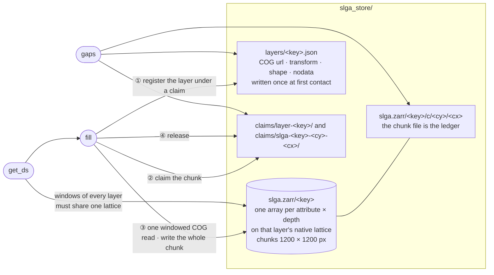
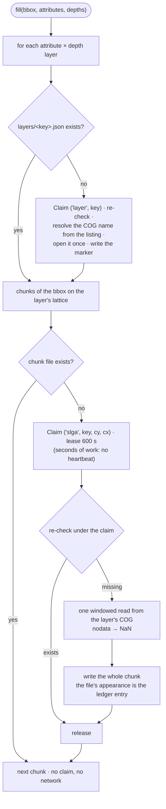

# pyslga

**Cached [SLGA](https://esoil.io/TERNLandscapes/Public/Pages/SLGA/index.html)
soil-property windows for Australia — download once per chunk, never
twice.** The Soil and Landscape Grid of Australia provides national
~90 m grids of soil properties (clay, sand, silt, pH, bulk density,
AWC, …) at six standard depths, served as one COG per attribute × depth
on the TERN datastore. Every pixel this machine ever downloads lands in
one sparse, chunk-indexed store, so repeat requests, overlapping AOIs
and new depth slices reuse everything already fetched. Part of the
[Borevitz Lab](https://biology.anu.edu.au/research/research-groups/borevitz-group-plant-genomics-climate-adaption) ecosystem.

## How it works

```
{tmp_dir}/slga_store/
├── slga.zarr/
│   ├── CLY_005_015/c/<cy>/<cx>   # one file per written 1200×1200-px chunk — the ledger
│   └── SND_005_015/...
├── layers/CLY_005_015.json        # the layer's COG url, transform, shape, nodata
└── claims/                        # cross-node mutex dirs, present only during a fetch
```

**The chunk file is the ledger.** Every write is one whole chunk and
zarr 3 commits it by atomic rename, so a chunk either exists complete
or not at all; there is no database. This branch (`gadi`) runs as many
PBS jobs on many Gadi nodes against one store on Lustre, where file
locks are node-local and SQLite is unsafe; see
[troi/docs/ledger.md](https://github.com/thestochasticman/troi/blob/gadi/docs/ledger.md).

- At a layer's first contact, its COG filename is resolved from the
  datastore listing (each attribute has its **own release date**, so
  names can't be hardcoded) and its grid — transform, shape, nodata —
  is read from the COG and recorded. Everything after that is offline
  arithmetic.
- Any bbox maps deterministically to a set of 1200 × 1200-px chunks on
  the layer's native grid. `Store.get_ds(bbox)` diffs them against the
  ledger and downloads **only the missing chunks**, each as one
  integer-aligned windowed read — no resampling, ever.
- Soil properties are time-invariant: no time axis, no dates.
- Nothing is ever resampled. `get_ds` returns native pixels with the
  attrs `crs`, `transform` (six affine numbers of the returned window),
  `nodata` and `native_res_m`, and raises if the requested layers are
  not on one lattice. `store.gaps(bbox, attributes, depths)` lists every
  chunk not on disk (`never_fetched` or `claimed_in_progress`) without
  touching the network; a layer never contacted is one `never_fetched`
  unit.
- Pixel reads require a TERN API key (listings are public) — set
  `tern_api_key` in `~/.config/Troi.json`,
  `TROI_TERN_KEY`, or pass `api_key=` per call. Keys are free
  from <https://account.tern.org.au/>.

### The pieces



There is no marker tree for pixels: the unit of fetching is one whole
1200 px chunk, zarr 3 writes it by temp file + rename, and the arrays
are created with `write_empty_chunks=True`, so a chunk file either
exists complete or not at all. The only markers are the layer
registrations, because a layer's filename and grid are unknown until
its COG is opened once. Shared primitives and the general protocol are
in
[troi/docs/ledger.md](https://github.com/thestochasticman/troi/blob/gadi/docs/ledger.md).

### A fill, step by step



### What `gaps()` can say

`gaps(bbox, attributes, depths)` enumerates the chunks of the bbox per
layer and classifies every one whose file is not on disk. It touches no
network.

| status | for a unit |
|---|---|
| `never_fetched` with detail `layer not registered` | the layer has never been contacted, so its chunking is unknown; counted as one unit |
| `claimed_in_progress` | another job is fetching that chunk right now |
| `never_fetched` | the chunk is not on disk; this should be 0 after a fill |

SLGA layers have no upstream 404 case: every layer the package knows
exists nationally, so there is no `absent/` tree.

## Usage

The core API is **troi-agnostic** — just a bbox:

```python
from pyslga.store import Store

store = Store()
bbox = [148.36265, -33.52606, 148.38265, -33.50606]  # [W, S, E, N]

ds = store.get_ds(bbox)   # texture triple Clay/Sand/Silt at 5-15cm
ds = store.get_ds(bbox, attributes=('Clay', 'pH_Water', 'Bulk_Density'),
                  depths=('0-5cm', '5-15cm', '15-30cm'))
ds['Clay_5-15cm']         # (lat, lon) DataArray

store.fill(bbox)          # → 0: already local
```

16 attributes × 6 depths are available — see `pyslga.slga.SLGA` for
the catalog.

Pipelines that speak the shared `troi.troi.Troi` use the
adapters (dates on the troi are ignored):

```python
ds = store.get_ds_troi(troi)
```

`download_slga_soils(troi)` remains as a thin wrapper.

## Performance

Live measurements against TERN — a ~2 × 2 km AOI (one *chunk* =
1200 × 1200 px ≈ 100 × 100 km at 90 m):

| Scenario | Downloaded | Time |
|---|---|---|
| Cold fill — Clay/Sand/Silt at 5–15 cm | 3 chunks | 3.8 s |
| Same request again | nothing | **0.0 s** |
| AOI shifted ~2 km (inside cached chunks) | nothing | **0.0 s** |
| New depth slice (0–5 cm), same attributes | 3 chunks — *the new layers only* | 3.6 s |
| Read cached window (1200² × 3 layers) | — | 0.4 s |

Store footprint: ~5 MB for six layer-chunks (~10 000 km² each of
Clay/Sand/Silt at two depths). Absolute times vary with network and
TERN load; the zeros are the point — they are ledger lookups, no
network involved.

## Install

### pip

```bash
pip install git+https://github.com/thestochasticman/pyslga.git@gadi
```

Dependencies (the `troi` core included, pulled from GitHub) are
declared in `pyproject.toml` and installed automatically.

### From source

```bash
git clone https://github.com/thestochasticman/pyslga.git
cd pyslga
pip install -e .
```

Package design (shared across the lab's packages — no inheritance,
composition only):

- **`Troi`** (from `troi`) — identity: what region.
- **`SLGA`** (`pyslga.slga`) — config: endpoint, attribute/depth catalogs.
- **`Paths`** (`pyslga.paths`) — derived locations of the store for a
  given `Config`.
- **`grid`** — chunk math parameterised by each layer's native grid
  (pure, offline-testable).
- **`Store`** (`pyslga.store`) — ties them together.

## Test

```bash
# offline (pure math + synthetic store):
python pyslga/grid.py     # True
python pyslga/paths.py    # True
python pyslga/store.py    # True

# live (small real reads from TERN — needs tern_api_key):
python pyslga/download_slga.py  # True
```
